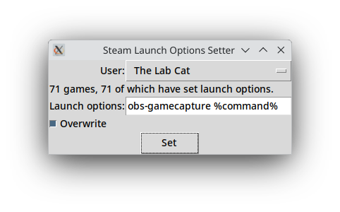

# Steam mass launch options setter

This is an app to configure all your Steam apps to have the same launch options. Optionally, it will only set those that are blank.

I created this so that I wouldn't have to manually set the VKCapture launch option, `obs-gamecapture %command%`, for every single one of my games manually.

## Dependencies:
This program relies on Python >= 3.10 (formally written in Python 3.13), plus the following non-native Python libraries, which can be installed using Pip:
- [VDF](https://pypi.org/project/vdf)

You can find executables with bundled Python and the dependencies in the Releases page of this repository.

## Usage

**It is strongly recommended that you exit Steam before using this.**
Although I don't think it's capable of destroying your library, it might get very confused with Steam writing to the same files.
The program will automatically look in the default location of the Steam directory on your OS. If it doesn't find it there, you'll get an error message. You can set the Steam path manually using the `STEAM_DIR` environment variable. This will be necessary if you are using the Flatpak version of Linux Steam, or Windows Steam isn't installed on your C: drive.
If "Overwrite" is not checked, the app will only set the options of all the apps with no set launch options. If it is checked, all launch options are ensured to be the new ones. Note that the "Overwrite" checkbox has no function if the "Launch options:" field is blank. The app will just erase all launch options for all apps when you click "Set".

## Legal:
Copyright 2025 Wilbur Jaywright d.b.a. Marswide BGL.

Licensed under the Apache License, Version 2.0 (the "License");
you may not use this file except in compliance with the License.
You may obtain a copy of the License at

    http://www.apache.org/licenses/LICENSE-2.0

Unless required by applicable law or agreed to in writing, software
distributed under the License is distributed on an "AS IS" BASIS,
WITHOUT WARRANTIES OR CONDITIONS OF ANY KIND, either express or implied.
See the License for the specific language governing permissions and
limitations under the License.

**S.D.G.**
